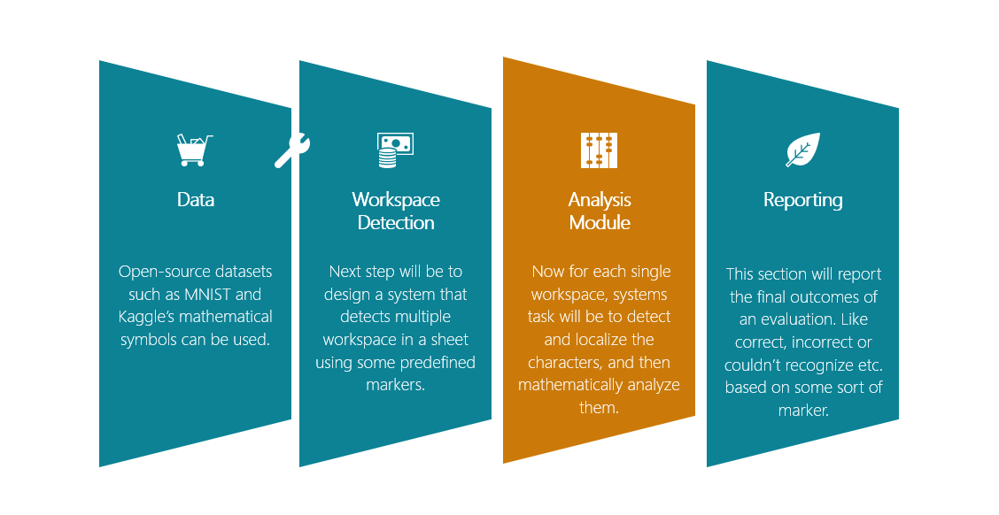
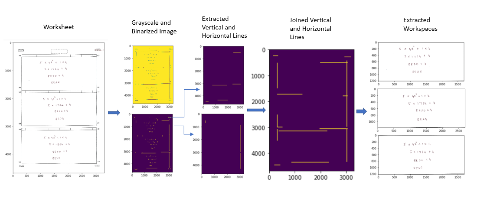
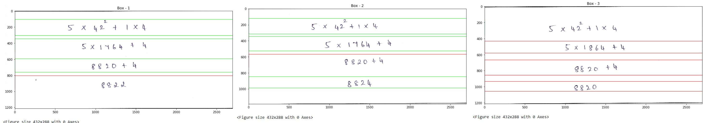

# Equation Detection and Evaluation
The  project  is  aimed  at  building  an  AI  system  based on Deep learning model (DCCNN) to identify handwritten mathematical equations from a sheet of paper,
digitize the steps of solving them and then evaluate them to provide feedback.

## Project Outline


## Building Blocks of the Algorithm


  
**_Steps of running the code_**:
+ mnist_data_conversion_images.ipynb loads the MNIST data from [MNIST](http://yann.lecun.com/exdb/mnist), converts it in image form and stores in different folders as per the classes.
+ Data Preprocessing of kaggle's symbol image has been already done in Preprocessing_Kaggle's_Symbol_For_Training_Neural_Network.ipynb file, and DCCNN neural network model has been trained on 15 classes of images.
+ Pre-processed and cleaned data used for model training can be downloded from [Data](https://drive.google.com/drive/folders/1-UiDxvAquxTKc4LPGOwCdE4zH0QcCL52?usp=sharing)
Weight and parameters after model training and testing have been saved into DCNN.h5 file.
+ Next check the final.ipynb file to test the algorithm on a worksheet. Steps to run the code is given below.

  **_Load model_** 
	Change the path where DCNN.h5 is saved in you system after downloding the files from git.
```
try:
    model = keras.models.load_model('C:/Users/Abhishek/Desktop/final_project/Autograding-handwritten-mathematical-worksheets-master/models/DCNN.h5', compile=False)

except Exception as e:
    print('Model couldnot be loaded',e)
```
There are two major steps which is done in order to detect and solve the equations from the worksheet.\
 **_Workspace detection_** is used to identify correctly the suitable space from the worsheet where equations are solved by a particular person. Output received from this section:\
 
 **_Load a worksheet_** for testing from the worksheets directory by changing the path in follwing code:
 
 ```
image_path = "C:/Users/Abhishek/Desktop/final_project/Autograding-handwritten-mathematical-worksheets-master/data/image_8.jpg"
A = 5
B = 1
X = 42
Y = 4

img = cv2.imread(image_path)
plt.figure(figsize=(10,10))
plt.imshow(img)
```
	 

  **_Analysis module_** will first detect the lines, predict the characters in each line and finally forms an equation with the predicted 
characters then evaluate them by marking boxes. Each detected line is evaluated.
1. Green Box represents that equation in that particular line is solved correctly.
2. Red Box represents that equation in that particular line is solved incorrectly.

	 
	
 **Conclusion :**
 The system  first took scanned worksheet with handwritten equations and sent it to the work-space detection module, where all the different possible rectangular work-spaces where detected. These detected work-spaces are then fed into the line extraction module, where each individual line from each of the work-space is detected and sent to next module for character segmentation. Here each character from the line is extracted and predicted using the Deep Columnar Neural Network(DCCNN) model. In the final stage the evaluation system will evalaute each line and then draw boxes around the line in green/red colour to indicate whether the solution provided is correct or not.
 
Project report can be found here: [report](report/report.pdf)

## Important dependencies to install before running the code.

	+ h5py (2.10.0)
	+ Keras (2.3.1)
	+ Keras-Applications (1.0.8)
	+ Keras-Preprocessing (1.1.0)
	+ matplotlib (3.1.1)
	+ numpy (1.17.3)
	+ opencv-python (4.1.1.26)
	+ pandas (0.24.0)
	+ Pillow (6.2.0)
	+ tensorboard (1.14.0)
	+ tensorflow (1.14.0)
	+ tensorflow-estimator (1.14.0)


